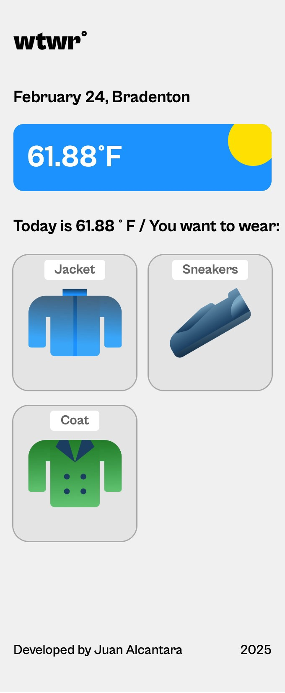
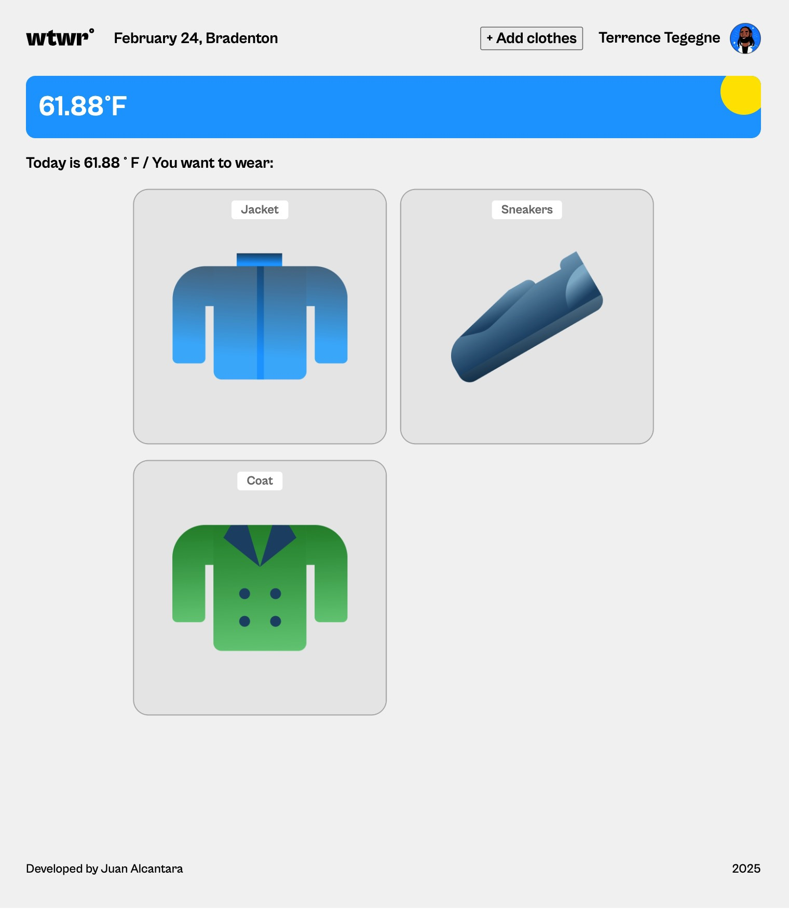
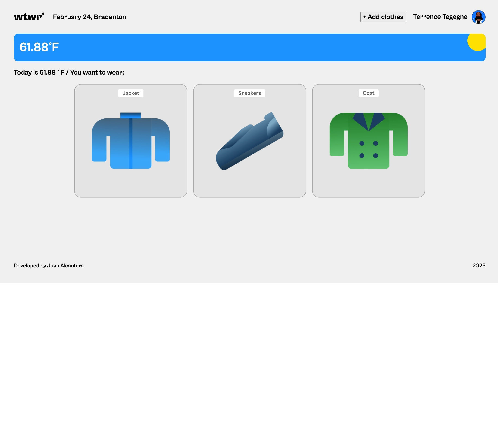

https://jcalcan.github.io/se_project_react/

# Project 10: What to Wear Weather App (WTWW)

### Overview

- Intro
- Figma
- Tech used
- Description and functionality
- Github link
- Backend Express server
- Images

**Intro**

WTWW is a project displaying the power of React combined with a weather API. All React components are displayed correctly on popular screen sizes using css grid and very minimal media queries. The app determines clothing suggestions based on the weather public data. Enjoy.

**Figma**

- [Link to the project on Figma](https://www.figma.com/design/F03bTb81Pw8IDPj5Y9rc5i/Sprint-10-%7C-WTWR?node-id=311-433&p=f&t=mVKXRi7p8WCtvag4-0)

**Tech used**

This project was fun and challenging. React was used for the responsive design along with css display grid. React hooks were maximized to increase loading and performance. Bandwith, server strain, mobile performance are all taken into account when designing the app.

**Description and Functionality**
WTWW is a site that provides suggestions based on the local weather conditions. You can upload garments of any type as a "digital closet' to help you save time choosing what to wear daily. The site is designed to function on any browser- mobile or desktop. No need to install special extensions. Plans to improve the project includes user database management, archiving garments feature, adding location services to determine user location.

**Github link**
https://jcalcan.github.io/se_project_react/

**Express Server Link**
[WTWR backend Server](https://github.com/jcalcan/se_project_express/)

**Images and screenshots**
Photo showcase of the design of the site in different dimensions for various devices. For example,
for mobile devices it would look like this - . For tablets like this  and regular desktops like this . The design and code were made with React and intuitive to users devices in mind. Easy to use, read and navigate were top priority elevating the users experience with the app.

Good luck and have fun!
